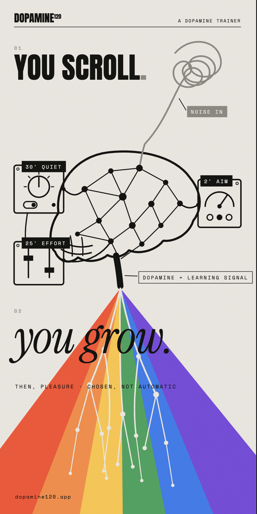

# DOPAMINE120

DOPAMINE120 is a Flutter monorepo for a dopamine trainer: a calm app that pairs
deliberate effort with a consciously chosen reward.
It is not a guilt tracker or a dopamine meter; it helps people move from
automatic scrolling to conscious action. See `PHYLOSOPHY.md` for the full
product philosophy.

## Project Notes

- [Russian Medium article about the project](https://medium.com/@huzhah/%D0%BA%D0%B0%D0%BA-%D1%8F-%D1%81%D0%BE%D0%B7%D0%B4%D0%B0%D1%8E-%D0%BF%D1%80%D0%B8%D0%BB%D0%BE%D0%B6%D0%B5%D0%BD%D0%B8%D0%B5-%D0%B4%D0%BB%D1%8F-boost%D0%B0-%D0%BC%D0%BE%D0%B7%D0%B3%D0%B0-303e26b54ebc)
- English Medium version: coming soon.

## Repository Layout

- `apps/dopamine120/` - the Flutter product app.
- `packages/core/` - shared infrastructure contracts (DI, use cases, storage).
- `packages/dopamine_ui/` - UI kit with design tokens, theme setup, and core
  `Dop*` widgets.
- `packages/dopamine_ui/example/` - Widgetbook catalog app for the UI kit.
- `packages/platform_bridge/` - native bridge for app blocking and health data.
- `packages/logger/` - debug-only `Log` API.
